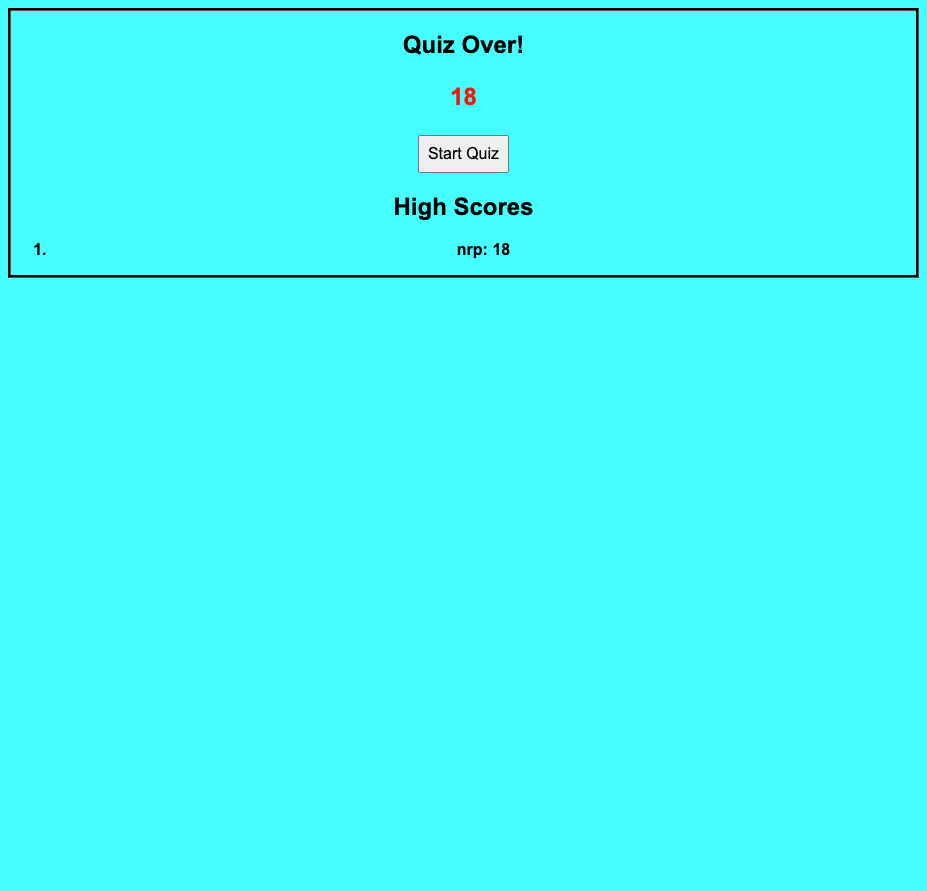

Title: Timed multiple-choice Coding Quiz

Description: This is a 30 second multiple-choice quiz based on Coding. It subtracts 5 seconds from the timer and you're score if you get an answer wrong. It keeps track of highscores and saves your initials to compare. I used functions and created multiple variables to create a timer, make the buttons reactive, and actively change the body according to the user inputs. I faced the challenge of getting the timer to work properly and to make it stop running into infinity. Also faced the challenge of having a function to display the different items in my questions array properly. Matching the initials and not just your high score at the end was also a bit of an issue, but figured it out through many Google searches.

How to Use: Simply press the start quiz button!

License: N/A

Link: https://nporter619.github.io/Coding-Quiz/

Screenshot:
